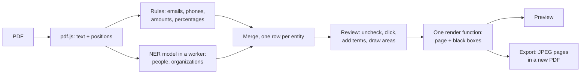

# Hushdeck

Anonymize a pitch deck in your browser. Nothing leaves your device.

**Try it:** https://victor-espnt.github.io/hushdeck/

<!-- Demo GIF goes here: docs/demo.gif -->

## The problem

Founders share decks to get feedback, and investors pass them to peers for a second opinion. The decks carry names, emails, phone numbers, revenue and valuation. Masking them by hand is slow and error-prone. Black boxes drawn in a PDF editor often leave the text underneath, and anyone can copy it back out.

Hushdeck finds the sensitive items, lets you review them, and exports a new PDF where they are gone.

## Why local

A deck under NDA should not be uploaded to a server to be anonymized. Hushdeck is a static page. The PDF is read, analyzed and rebuilt in the browser tab. There is no backend, no analytics and no telemetry. Nothing is stored: close the tab and the document is gone.

The one network request after the page loads is the download of the name detection model from Hugging Face. It happens once, and then the browser keeps the model.

## Check it yourself

You don't have to trust this README.

1. **Network tab.** Open the developer tools and drop a deck. The only outside hosts are `huggingface.co` and a `*.hf.co` CDN host, on the first run only. Your PDF is never in a request.
2. **Airplane mode.** Run one deck so the model is cached. Turn on airplane mode, then drop another deck without reloading the page. Detection, review and export all still work.
3. **The exported file.** With [Poppler](https://poppler.freedesktop.org/) installed:

   ```sh
   pdftotext anonymized-deck.pdf -   # prints nothing: there is no text layer
   pdfinfo anonymized-deck.pdf       # Creator and Producer "Hushdeck"; no title, author or dates
   ```

## How it works



1. **Text.** pdf.js extracts every text item with its position. Each page becomes one string, with a map from each character offset back to its item.
2. **Rules.** Regular expressions find emails, amounts (`$2M`, `3,2 Md€`, `500k€`) and percentages. libphonenumber-js finds phone numbers, French and international. Line breaks count as spaces, so a number split over two lines is still found.
3. **Names.** A BERT NER model runs in a Web Worker, page by page. Its tokens are placed back in the text, grouped into words, and extended to word boundaries. Each name is then searched on every page, so it is also masked where the model missed it.
4. **Review.** Every detection starts masked. The panel groups them by type. You can uncheck a value, click a zone on the page, add a term, or draw an area by hand.
5. **Render and export.** One function draws a page and burns black boxes over the masked areas. The preview uses it, and so does the export. Each page is rendered at scale 2, encoded as JPEG, and placed in a new PDF at its original size.

## Decisions

- **Rasterized export.** Removing text from a PDF is fragile. Text can hide in annotations, form fields, metadata, fonts or incremental updates. Hushdeck rebuilds the document from page images instead. The export has no text layer, no annotations and no original metadata. It cannot leak what it does not contain. The trade-off: the text is no longer selectable, and the file is larger.
- **Fail closed.** Everything detected is masked by default, and you unmask what you want to keep. A value masked by mistake costs a black box. A value left visible by mistake is a leak. The score threshold for names is low for the same reason.
- **Zones are estimated, then widened, never trimmed.** PDF text items have no per-character positions. A name inside a longer line gets a horizontal range estimated from typical character widths. The box is then padded by 0.3 em along the text and 2 points across it. A box may cover a letter too many. It should never leave a letter out.
- **An English model under MIT.** `Xenova/bert-base-NER` is English-only and misses names that a better multilingual model would catch. Stronger multilingual models exist, but under non-commercial licenses. Hushdeck keeps a license that lets anyone use and fork it, and relies on the review step to catch what the model misses.
- **One row per entity.** "Claire", "Dubois" and "Claire Dubois" are one person. The panel shows one row, and its checkbox acts on every variant. Unmasking a name unmasks all its forms, and masking it masks them all.
- **Export waits for the NER.** The rules run at once, and names arrive page by page. The export button stays disabled until the model has read every page, so you cannot export a deck with half of its names found.
- **The CSP covers the workers too.** GitHub Pages cannot send headers, so the Content-Security-Policy is a meta tag. A meta policy does not reach workers loaded from their own URL. Hushdeck starts its workers (pdf.js, the NER model) from blob URLs, so they inherit the page's policy. `connect-src` allows this site, `huggingface.co` and `*.hf.co`, nothing else.
- **Reproducible export, neutral file name.** The export has no dates, no document ID and no metadata except a neutral Producer and Creator. The same deck with the same choices gives the same file, byte for byte, in the same browser. The file is always named `anonymized-deck.pdf`, never after the original.

## Known limitations

- **No OCR.** Text inside images is not seen: logos, screenshots, scanned pages, charts exported as pictures. Draw manual areas over them. Hushdeck warns you when a page has no text layer.
- **The NER is English and imperfect.** It misses some names, for example initials in an avatar. It also flags words that are not sensitive, such as "SAFE" or "Paris". Review every deck before exporting.
- **Zone width is approximate.** The estimate uses typical character widths, not the real font. Very narrow or very wide fonts can shift a box. The padding absorbs most of this. Check the preview.
- **Fonts that are not embedded are replaced.** If the PDF relies on a font it does not embed, the preview and the export use a system font. The layout can shift slightly.
- **US numbers need their country code.** Phone detection defaults to France. `(415) 555-0142` is not found, while `+1 415 555 0142` is.
- **About 124 MB on first use.** That is the model (109 MB) and the ONNX runtime (14 MB). Later visits load them from the browser cache.
- **Files over 50 MB are refused.** Every page is rendered at scale 2 in memory.
- **Anonymizing is not de-identifying.** Masking names and numbers does not hide the market, the product, the chart shapes or the writing style. Someone who knows the space may still recognize the company. Decide what else to mask with that in mind.

## Sample deck

`public/sample-deck.pdf` is a 9-page deck for a fictional company, Nimbalo. Every name, number and contact in it is invented. It covers the cases Hushdeck has to handle: emails mid-sentence, phones in several formats including one split over two lines, amounts such as `3,2 Md€` and `500k€`, names in a team slide, and logos set over two lines.

Click **Try with a sample deck** on the site to load it.

## Stack

- Vite, React, TypeScript (strict), plain CSS
- [pdf.js](https://github.com/mozilla/pdf.js) (`pdfjs-dist`): rendering and text extraction
- [pdf-lib](https://github.com/Hopding/pdf-lib): building the exported PDF
- [libphonenumber-js](https://gitlab.com/catamphetamine/libphonenumber-js): phone numbers
- [Transformers.js](https://github.com/huggingface/transformers.js) with ONNX Runtime Web, single-threaded, in a Web Worker
- Model: [`Xenova/bert-base-NER`](https://huggingface.co/Xenova/bert-base-NER), 8-bit quantized
- Vitest for unit tests
- GitHub Pages, deployed by a GitHub Actions workflow

## Run locally

Requires Node.js 20.19 or later (22.12 or later on the 22 line).

```sh
npm ci
npm run dev      # http://localhost:5173/hushdeck/
npm test
npm run lint
npm run build    # static site in dist/
```

The dev server does not apply the Content-Security-Policy, because Vite needs inline scripts. `npm run build && npm run preview` serves the site with it.

## Licenses

- Hushdeck: MIT, see [LICENSE](LICENSE). The sample deck is part of the repository and under the same license.
- Model: [`dslim/bert-base-NER`](https://huggingface.co/dslim/bert-base-NER), MIT, trained on CoNLL-2003. Hushdeck uses the ONNX conversion `Xenova/bert-base-NER`.
- Dependencies: pdf.js and Transformers.js are Apache-2.0. pdf-lib, libphonenumber-js, ONNX Runtime Web, React and Vite are MIT.

## How this was built

Hushdeck was built over two evenings with [Claude Code](https://claude.com/claude-code). [CLAUDE.md](CLAUDE.md) served as the specification: goals, non-negotiables, stack and known pitfalls. The work followed a numbered plan, one step at a time, with one commit per step. `git log` shows them in order.
